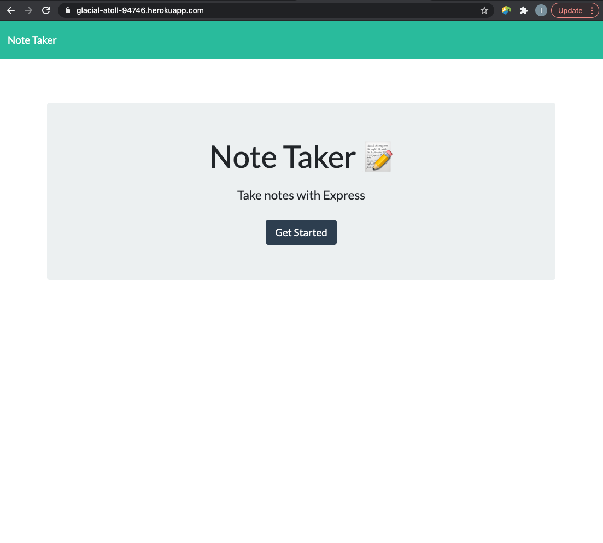
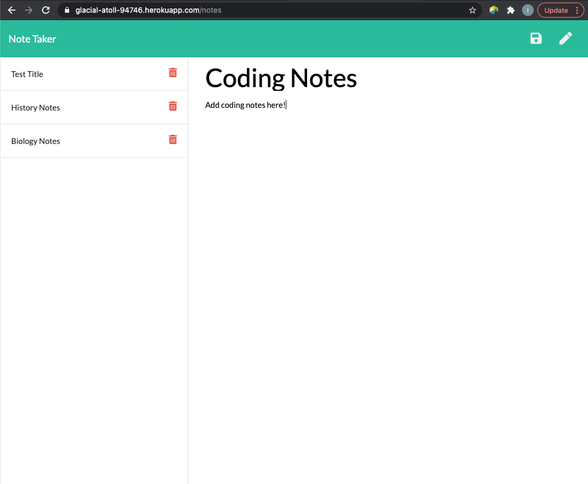

# Express Note Taker
This site was developed with the intention of creating an application that can be used to write, save, and delete notes. 

## Motivation
The motivation behind this project was to create a note taker application that utilizes express backend to save and retrieve data from a JSON file, and deploy to an heroku app.

## Tech/Framework Used
* Node.js
* Express
* HTML/CSS
* Javascript
* JSON
* Heroku
* Built with Visual Code Studio

## Code Example
Here is an example of the note taker application:

## Features
* Write, save, and delete notes
* Express back-end
* Heroku Deployment

## Installation
If choosing to run locally, clone this repository to your machine or download zip file.

## Usage
After the repository has been cloned, use terminal to change directories into "Express-Note-Taker" folder. Run the command "node server.js" and then view http://localhost:3000/. Otherwise, the app can be accessed live at the Heroku link provided below. 

## License 

> You can reference the full license [here](https://github.com/Picke1id/Employee-Summary/blob/master/LICENSE).

This project is licensed under the terms of the MIT license.

## Link
* Heroku Deployment: (https://glacial-atoll-94746.herokuapp.com/)
